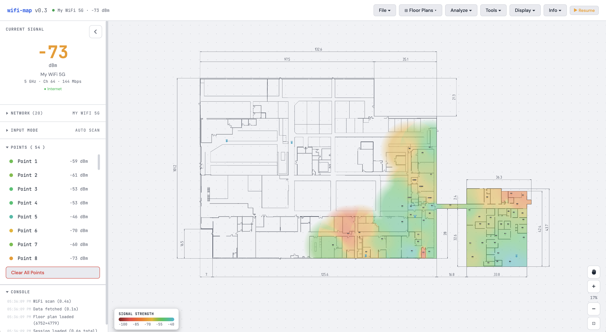

# WiFi Heatmap Builder

A free, local WiFi heatmap tool — like Ekahau or NetSpot, but runs entirely on your machine with zero setup. Upload a floor plan, walk around clicking to record signal strength, and watch a heatmap build in real time.

  



## Quick Start

**Windows** — double-click `start.bat`

**Mac / Linux** — double-click `start.sh` (or run `./start.sh`)

Or manually: `python server.py`

Open **http://localhost:8199** in your browser. No pip installs, no config, no API keys.

## How It Works

1. **Upload a floor plan** (PNG, JPG, or PDF)
2. **Mark your access points** so the heatmap knows where signal comes from
3. **Walk around and click** — each click instantly records your WiFi signal at that spot
4. **Repeat** — more points = better heatmap
5. **Draw walls** for accurate room-by-room signal modeling
6. **Export** as JSON or PNG when you're done

WiFi scanning runs continuously in the background (~4s intervals), so clicking is instant — no waiting for scans.

## Features

**Heatmap modes** — Signal Strength (dBm), Signal-to-Noise Ratio, Connectivity (internet speed), and Overall Quality (blended score of all three). Filter by specific network or band, adjust color thresholds, or reset to defaults.

**Access points** — Place APs on the map and the heatmap biases signal interpolation toward them, producing more realistic coverage patterns. Name them for easy reference.

**Walls & perimeter** — Draw walls with material presets (drywall, concrete, metal, etc.) to model signal attenuation between rooms. Trace your building perimeter to clip the heatmap to interior spaces. Walls chain together and snap to endpoints for fast drawing.

**Satellite map** — Load satellite imagery by street address and align it to your floor plan. Extends well beyond the building for surrounding context. Supports opacity control and outside-only mode.

**Continuous scanning** — Background WiFi + speed tests run automatically. The sidebar shows live signal info with a real-time counter since last scan. Pause/resume anytime.

**Everything else** — Multi-floor support, PDF import, drag & drop, pan/zoom, dark mode, undo (Ctrl+Z), scale calibration, annotations, auto-save, and a built-in info panel explaining every feature.

## Platform Support

| Platform | Auto-Scan Method |
|----------|-----------------|
| macOS | CoreWLAN via Swift (primary), `system_profiler` (fallback) |
| Windows | `netsh wlan show interfaces` |
| Linux | `nmcli` / `/proc/net/wireless` / `iwconfig` |

If auto-scan doesn't work on your setup, switch to **Manual mode** and enter signal values with a slider.

## Tips

- **20-30+ points per floor** for good accuracy
- **Place your APs first** — they significantly improve heatmap quality
- **Draw walls** — this is what makes the heatmap show realistic room-by-room drop-off
- **Trace the perimeter** — clips the heatmap to your building outline
- **Try Connectivity mode** — finds spots with strong WiFi but no actual internet

## Project Structure

```
wifi-map/
├── server.py         # Python server (WiFi scanning + file serving)
├── index.html        # Entire web app (single file)
├── wifi_scan.swift   # macOS WiFi scanner
├── start.bat         # Windows launcher
├── start.sh          # Mac/Linux launcher
└── README.md
```

100% local — no data leaves your machine. Python 3.7+ with zero dependencies.

## License

[MIT](LICENSE)
